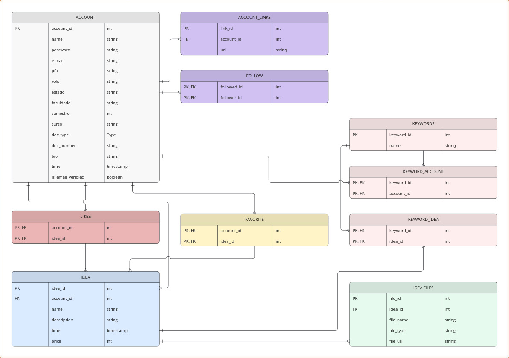

# Visão de Dados (MER)

O Modelo Entidade-Relacionamento (MER) descreve a estrutura lógica do banco de dados PostgreSQL da aplicação. Ele é definido pelo script SQL encontrado em `Back/postgres_init/banco.sql` e visualizado no diagrama abaixo.

- **Principais Tabelas/Entidades:**
    - `ACCOUNT`: Armazena informações dos usuários (estudantes e investidores).
    - `IDEA`: Armazena informações sobre as ideias ou projetos cadastrados pelos usuários.
    - `KEYWORDS`: Tabela centralizada para armazenar palavras-chave (tags) que podem ser associadas a contas ou ideias.
    - Tabelas Associativas (para relacionamentos N:M): `FOLLOW`, `KEYWORD_ACCOUNT`, `KEYWORD_IDEA`, `LIKES`, `FAVORITE`.
    - Tabelas de Atributos/Relacionamentos 1:N: `ACCOUNT_LINKS`, `IDEA_FILES`.

- **Relações Principais e Cardinalidades:**
    - **`ACCOUNT` e `IDEA` (1:N):** Uma conta (`ACCOUNT`) pode criar várias ideias (`IDEA`). Uma ideia pertence a apenas uma conta. (Restrição `fk_account` na tabela `IDEA`).
    - **`ACCOUNT` e `ACCOUNT_LINKS` (1:N):** Uma conta pode ter vários links (`ACCOUNT_LINKS`). Um link pertence a apenas uma conta. (Restrição `fk_account` na tabela `ACCOUNT_LINKS`).
    - **`IDEA` e `IDEA_FILES` (1:N):** Uma ideia pode ter vários arquivos associados (`IDEA_FILES`). Um arquivo pertence a apenas uma ideia. (Restrição `fk_idea` na tabela `IDEA_FILES`).
    - **`ACCOUNT` e `FOLLOW` (N:M):** Uma conta pode seguir (`follower_id`) várias outras contas (`followed_id`), e uma conta pode ser seguida por várias outras. (Tabela associativa `FOLLOW`).
    - **`ACCOUNT` e `KEYWORDS` (N:M):** Uma conta pode estar associada a várias palavras-chave, e uma palavra-chave pode estar associada a várias contas. (Tabela associativa `KEYWORD_ACCOUNT`).
    - **`IDEA` e `KEYWORDS` (N:M):** Uma ideia pode estar associada a várias palavras-chave, e uma palavra-chave pode estar associada a várias ideias. (Tabela associativa `KEYWORD_IDEA`).
    - **`ACCOUNT` e `IDEA` via `LIKES` (N:M):** Uma conta pode "curtir" várias ideias, e uma ideia pode ser "curtida" por várias contas. (Tabela associativa `LIKES`).
    - **`ACCOUNT` e `IDEA` via `FAVORITE` (N:M):** Uma conta pode "favoritar" várias ideias, e uma ideia pode ser "favoritada" por várias contas. (Tabela associativa `FAVORITE`).

- **Atributos Principais (Exemplos):**
    - **`ACCOUNT`:** `account_id` (PK, SERIAL), `name` (NOT NULL), `password` (NOT NULL, hashed), `email` (NOT NULL, UNIQUE), `role` (NOT NULL), `doc_type` (NOT NULL), `doc_number` (NOT NULL, UNIQUE), `is_email_verified`, `created_at`, `pfp`, `estado`, `faculdade`, `semestre`, `curso`, `bio`.
    - **`IDEA`:** `idea_id` (PK, SERIAL), `account_id` (FK, NOT NULL), `name` (NOT NULL), `description`, `time`, `price`.
    - **`KEYWORDS`:** `keyword_id` (PK, SERIAL), `name` (NOT NULL, UNIQUE).
    - *(Os atributos das tabelas associativas são geralmente apenas as chaves estrangeiras que formam a chave primária composta).*