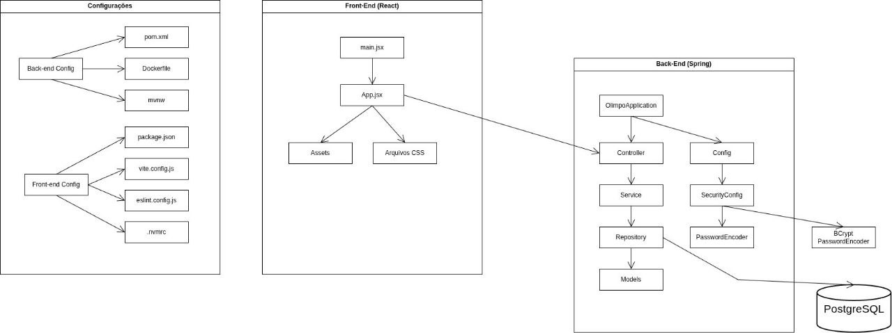

# Visão Lógica

O sistema back-end (Spring Boot) é subdividido logicamente nos seguintes pacotes principais, seguindo o padrão da Arquitetura em Camadas:

- **`com.olimpo.controller` (Camada de Apresentação/API):** Contém as classes `@RestController` que expõem os endpoints HTTP. Recebe requisições, valida entradas básicas e delega para a camada de serviço. Comunica-se com o exterior via HTTP/JSON.
- **`com.olimpo.service` (Camada de Negócio):** Contém as classes `@Service` que implementam a lógica de negócio principal da aplicação (regras de cadastro, busca, etc.). Orquestra as operações, podendo chamar outros serviços ou a camada de repositório.
- **`com.olimpo.repository` (Camada de Acesso a Dados):** Contém as interfaces que estendem `JpaRepository`. É responsável pela comunicação com o banco de dados (operações CRUD). Abstrai os detalhes do SQL/JDBC.
- **`com.olimpo.models` (Camada de Domínio/Entidades):** Contém as classes `@Entity` que mapeiam as tabelas do banco de dados (ex: `Account.java`).
- **`com.olimpo.config`:** Contém classes de configuração do Spring (ex: `SecurityConfig.java` com beans `@Configuration` e `@Bean`).
- **`com.olimpo.exception`** Contém classes de exceção customizadas.
- **`com.olimpo.handler`** Contém o `@ControllerAdvice` para tratamento global de exceções.

## Comunicação dos Pacotes

