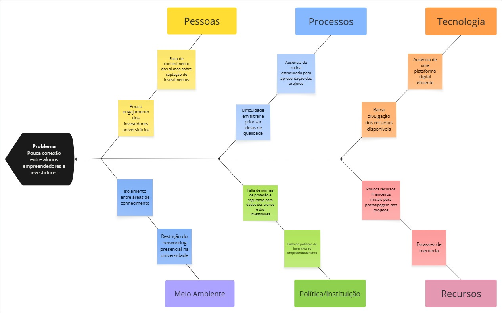

# **Problema**

## **Contexto**

O contexto desse projeto são os ambientes universitários, onde muitos alunos tem ideias inovadoras mas enfrentam dificuldades para transformar essas ideias em negócios viáveis. Do outro lado há investidores, sejam eles internos ou externos as universidades, que estão interessados em apoiar essas ideias, mas não tem um canal estruturado para ter contato com as ideias e projetos dos alunos.

## **Problema encontrado**

O principal problema identificado é a falta de uma plataforma centralizada e eficiente que conecte estudantes da UnB com potenciais investidores. Atualmente, a comunicação ocorre de forma dispersa (eventos, grupos informais ou redes sociais), dificultando tanto para os alunos divulgarem suas ideias quanto para investidores encontrarem iniciativas que sejam promissoras. Com isso, muitas oportunidades deixam de ser aproveitadas, e bons projetos acabam não recebendo o apoio financeiro necessário para se desenvolverem.

## **Solução**

A solução proposta é o desenvolvimento de um site exclusivo paraque possuiEmpreende Un, com duas áreas distintas: uma para alunos cadastrarem, divulgarem e detalharem suas ideias de negócio, e outra para investidores visualizarem, acompanharem e entrarem em contato com os projetos que desejarem apoiar. Esse site facilita o encontro entre as necessidades e os interesses de ambos os públicos, promovendo inovação e empreendedorismo dentro da universidade.

Espera-se que essa solução contribua para solucionar o problema, centralizando e organizando a apresentação de ideias, assim aumentando a visibilidade dos projetos, facilitando o contato seguro entre alunos e investidores, permitindo o acompanhamento do progresoo dos projetos, e fomentando a cultura empreendedora das universidades.