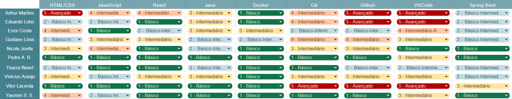

# **Quadro de conhecimento**

## **Introdução**
Este documento tem como finalidade apresentar o quadro de conhecimento da equipe, evidenciando as competências, habilidades e experiências individuais de cada integrante em relação às tecnologias e áreas envolvidas no projeto. Esse levantamento permite compreender o perfil técnico do time, identificar pontos fortes, lacunas de conhecimento e oportunidades de aprimoramento, servindo como base estratégica para a definição de treinamentos e a alocação das equipes de desenvolvimento.

## **Quadro de conhecimentos da Equipe**

Levando em consideração as tecnologias iniciais e básicas do projeto, as seguintes tecnologias foram colocadas para avaliação dos membros:

- HTML/CSS: Linguagem de marcação (HTML) e de estilo (CSS) usadas para estruturar e formatar páginas web;
- JavaScript: Linguagem de programação para adicionar interatividade e funcionalidade a páginas web;
- React: Biblioteca JavaScript para criar interfaces de usuário;
- Java: Linguagem de programação orientada a objetos e multiplataforma;
- Docker: Plataforma para rodar aplicações em contêineres isolados;
- Git: Sistema de controle de versão que registra e gerencia alterações em arquivos para facilitar o trabalho colaborativo e o histórico de versões;
- Github: Plataforma para hospedar códigos e colaborar em projetos;
- VSCode: Editor de código leve e altamente customizável;
- Spring Boot: Framework Java que facilita o desenvolvimento de aplicações web prontas para produção;

A partir disso, foi fornecido um formulário para os membros da equipe para definir os níveis de conhecimento a partir das métricas:

- **1 - Básico:** Já ouvi falar, porém meu nível de conhecimento e bem inicial;
- **2 - Básico-Intermediário:** Mexi um pouco e estou começando a entender as funcionalidades tendo consciencia;
- **3 - Intermediário:** Conheço bem e consigo me virar sozinho;
- **4 - Intermediário-Avançado:** Já utilizei bastante a tecnologia e sei muita coisa.
- **5 - Avançado:** Sou experiente com a tecnologia.

Dessa forma, abaixo pode ser visto o quadro de conhecimentos dos membros da equipe.

[Quadro de Conhecimento](https://docs.google.com/spreadsheets/d/1ABtbuxjm9T_zXHCj7nDa_KArg1jd_zqRlf_i6WEViEI/edit?hl=pt-br&pli=1&gid=0#gid=0)